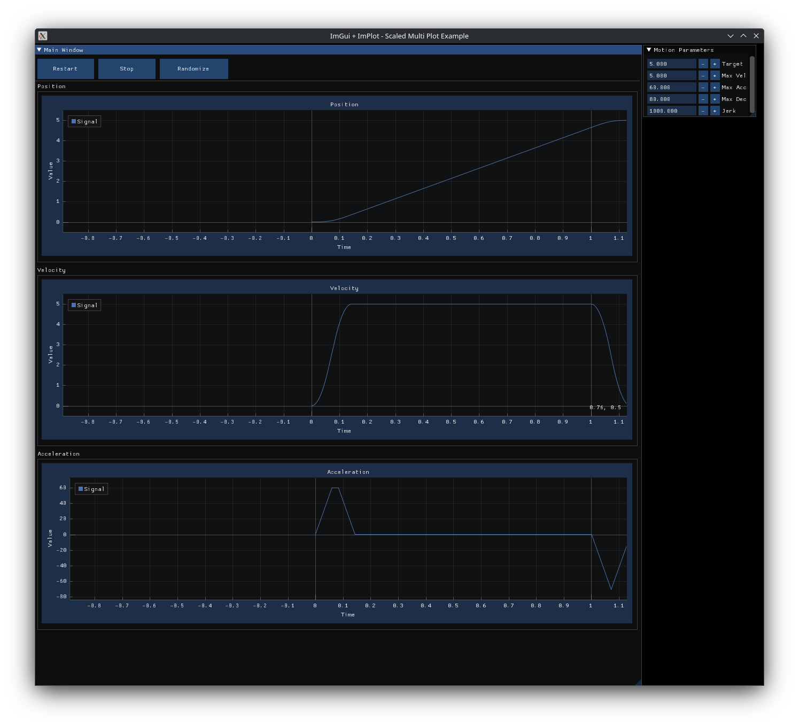

# 🚀 FASTEST TRAJECTORY GENERATOR EVER 🏎️💨  
*Buckle up!* This is not your average motion planner.  
It’s built for **speed, smoothness, and pure CNC-style adrenaline**.  
If you blink, you’ll miss the move. ⚡  

# ⚠️ DEVELOPMENT NOTICE

This project is **still in development** and needs your attention.\
Expect bugs, incomplete features, and rapid changes.

You can try to build it on **Linux (Debian/Ubuntu, Fedora, Arch)**, and
also experiment on **Windows** and **macOS**.\
👉 My suggestion: if you want cross-platform builds, use **CMake +
vcpkg** (Windows/macOS) or your distro's package manager (Linux).

------------------------------------------------------------------------

# Periodic Task / Motion Visualization (ImGui + ImPlot)

This app shows real-time **Position / Velocity / Acceleration** plots
using **Dear ImGui** and **ImPlot**.\
It includes a simple jerk-limited simulator to **Calculate** a motion
profile from user inputs.



------------------------------------------------------------------------

## What's inside

-   **GLFW** window + OpenGL2 backend\
-   **Dear ImGui** UI (controls + windows)\
-   **ImPlot** for fast plotting (3 stacked subplots)\
-   Random motion generator (Start/Stop)\
-   **Calculate button**: simulate trajectory with Target, Vmax, Amax,
    Dmax, Jmax

------------------------------------------------------------------------

## Build Requirements

-   **CMake ≥ 3.22**\
-   **C++17 compiler**\
-   **OpenGL dev headers**\
-   X11 (for Linux + GLFW)

------------------------------------------------------------------------

### 🐧 Debian/Ubuntu

``` bash
sudo apt update
sudo apt install -y build-essential cmake   libgl1-mesa-dev libglu1-mesa-dev   libx11-dev libxrandr-dev libxi-dev   libxinerama-dev libxcursor-dev
```

### 🐧 Fedora

``` bash
sudo dnf install -y gcc-c++ cmake   mesa-libGL-devel mesa-libGLU-devel   libX11-devel libXrandr-devel libXi-devel   libXinerama-devel libXcursor-devel
```

### 🐧 Arch Linux

``` bash
sudo pacman -S --needed base-devel cmake   mesa glu libx11 libxrandr libxi   libxinerama libxcursor
```

------------------------------------------------------------------------

### 🪟 Windows

-   Install **Visual Studio 2022** (with Desktop development C++
    workload)\

-   Install **CMake**\

-   Use **vcpkg** for dependencies:

    ``` bash
    git clone https://github.com/microsoft/vcpkg
    ./vcpkg/bootstrap-vcpkg.sh
    ./vcpkg install glfw3
    ```

### 🍏 macOS

``` bash
brew install cmake glfw
```

------------------------------------------------------------------------

✅ With these, you can build and run the project across **Linux /
Windows / macOS**.\
If you want, I can also add **full CMakeLists.txt updates** to
auto-fetch **ImGui + ImPlot** with `FetchContent`.
